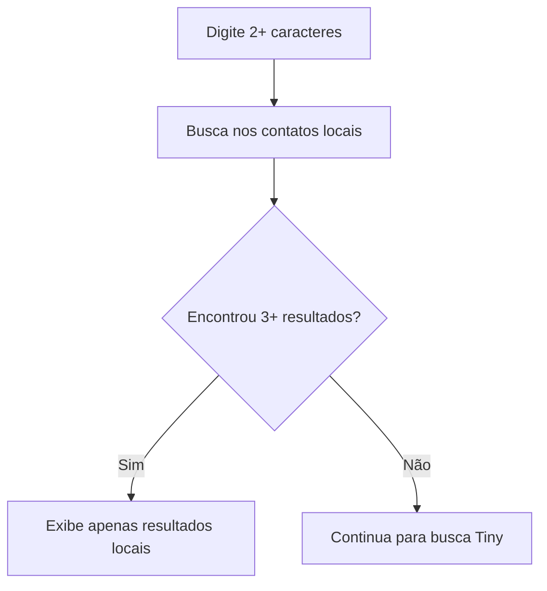
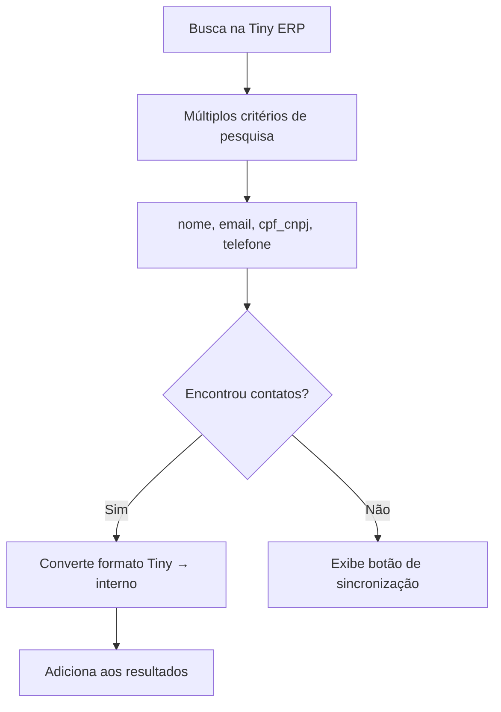
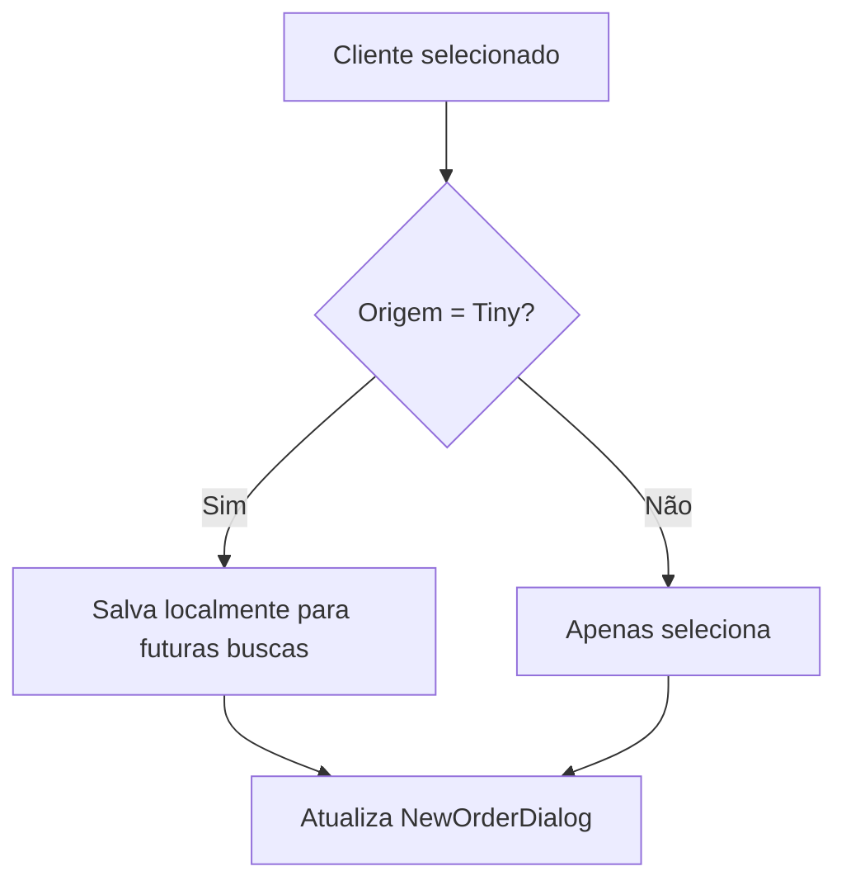

# 🔍 Busca Avançada de Clientes - Novo Pedido

## 📋 Descrição

Implementação de um sistema avançado de busca de clientes para o formulário de "Novo Pedido", substituindo o seletor simples por uma busca completa que inclui integração com a API da Tiny ERP.

## ✨ Funcionalidades Implementadas

### 🔍 Busca Inteligente
- **Busca em tempo real** com debounce de 300ms
- **Múltiplos critérios de busca**:
  - Nome completo
  - E-mail
  - CPF/CNPJ (com ou sem formatação)
  - Telefone (com ou sem formatação)
  - Nome da empresa
- **Busca local e remota**: Primeiro busca nos contatos locais, depois na API da Tiny ERP

### 🔄 Sincronização com Tiny ERP
- **Botão de sincronização** visível ao lado da busca
- **Sincronização automática** quando não encontra resultados locais
- **Feedback visual** do status da sincronização
- **Armazenamento local** automático dos contatos encontrados na Tiny

### 📱 Interface Moderna
- **Design responsivo** e mobile-friendly
- **Indicadores visuais** de origem dos dados (Local/Tiny ERP)
- **Tipo de correspondência** mostrado para cada resultado
- **Formatação de documentos** com máscara de segurança
- **Ícones distintivos** para pessoa física/jurídica

## 🏗️ Arquitetura

### Componentes Criados

#### `CustomerSearch.tsx`
Componente principal que implementa toda a lógica de busca:

```typescript
interface CustomerSearchProps {
  selectedCustomerId?: string;
  onCustomerSelect: (customer: Customer) => void;
  onError?: (error: string) => void;
  className?: string;
}
```

**Funcionalidades principais:**
- Busca local em `localCustomers`
- Busca remota via `searchTinyContactByCriteria`
- Sincronização completa via `syncContactsWithTiny`
- Gerenciamento de estado local com localStorage
- Detecção de cliques fora para fechar resultados

### Integrações Existentes Utilizadas

#### `searchTinyContactByCriteria`
```typescript
// de src/lib/services/tinyService.ts
export const searchTinyContactByCriteria = async (searchCriteria: {
  email?: string;
  cpf_cnpj?: string;
  telefone?: string;
  nome?: string;
}): Promise<Contact | null>
```

#### `syncContactsWithTiny`
```typescript
// de src/lib/services/contactService.ts
export async function syncContactsWithTiny(): Promise<{
  added: number;
  updated: number;
  failed: number;
}>
```

## 🎯 Fluxo de Funcionamento

### 1. Busca Local (Primeira Prioridade)


### 2. Busca na Tiny ERP (Segunda Prioridade)


### 3. Seleção e Persistência


## 🔧 Modificações no NewOrderDialog

### Estados Atualizados
```typescript
// Antes
const [customerId, setCustomerId] = useState('');

// Depois  
const [selectedCustomer, setSelectedCustomer] = useState<Customer | null>(null);
```

### Handlers Substituídos
```typescript
// Antes
const handleCustomerChange = (customerId: string) => {
  setCustomerId(customerId);
  // ...
};

// Depois
const handleCustomerSelect = (customer: Customer) => {
  setSelectedCustomer(customer);
  setErrors(prev => ({ ...prev, customer: undefined }));
};

const handleCustomerError = (error: string) => {
  setErrors(prev => ({ ...prev, customer: error }));
};
```

### Interface do Primeiro Passo
```typescript
// Substituído seletor simples por busca avançada
<CustomerSearch
  selectedCustomerId={selectedCustomer?.id}
  onCustomerSelect={handleCustomerSelect}
  onError={handleCustomerError}
  className={errors.customer ? "border-red-500" : ""}
/>
```

## 🎨 Recursos de UX/UI

### 🎯 Resultados de Busca
- **Layout card** com informações completas
- **Badges indicativas** da origem (Local/Tiny ERP)
- **Tipo de correspondência** (Nome, E-mail, CPF/CNPJ, etc.)
- **Formatação de documentos** com segurança (CPF: 123.***.***-45)
- **Separadores visuais** entre resultados

### 🔄 Estados da Sincronização
- **Idle**: Botão normal de sincronização
- **Loading**: Spinner animado + texto "Sincronizando..."
- **Success**: Alert verde com contadores de resultados
- **Error**: Alert vermelho com mensagem de erro

### 📱 Responsividade
- **Desktop**: Layout completo com todas as informações
- **Mobile**: Layout adaptado com informações essenciais
- **Touch-friendly**: Botões e áreas clicáveis otimizadas

## 🚀 Como Usar

### 1. Acessar Novo Pedido
- Clique no botão "NOVO PEDIDO" no kanban
- A primeira seção agora apresenta a busca avançada

### 2. Buscar Cliente
- Digite pelo menos 2 caracteres
- A busca é feita automaticamente em:
  - Contatos locais (instantâneo)
  - API da Tiny ERP (se necessário)

### 3. Sincronizar com Tiny ERP
- **Automático**: Quando não encontra resultados suficientes
- **Manual**: Clique no botão de sincronização
- **Em caso de erro**: Clique no botão "Sincronizar com Tiny ERP"

### 4. Selecionar Cliente
- Clique no cliente desejado
- **Clientes da Tiny** são automaticamente salvos localmente
- Continue o fluxo normal do pedido

## 🛠️ Tecnologias Utilizadas

### Frontend
- **React 18** com TypeScript
- **Tailwind CSS** para estilização
- **Shadcn/ui** para componentes base
- **Lucide React** para ícones

### Integrações
- **API Tiny ERP** via serviços existentes
- **localStorage** para cache local
- **Debounce** para otimização de performance

### Estado e Gerenciamento
- **useState** para estados locais
- **useEffect** para efeitos e cleanup
- **useRef** para referências DOM

## 📊 Benefícios da Implementação

### 🎯 Para o Usuário
- **Busca mais rápida** e intuitiva
- **Menos cliques** para encontrar clientes
- **Feedback visual** claro do que está acontecendo
- **Dados sempre atualizados** da Tiny ERP

### 🔧 Para o Sistema
- **Cache local** reduz chamadas à API
- **Sincronização inteligente** apenas quando necessária
- **Tratamento de erros** robusto
- **Performance otimizada** com debounce

### 💡 Para a Experiência
- **Interface moderna** e responsiva
- **Feedback em tempo real** das ações
- **Consistência visual** com o restante do sistema
- **Acessibilidade** melhorada

## 🔮 Próximos Passos

### Possíveis Melhorias
1. **Cache com TTL**: Implementar expiração automática do cache local
2. **Busca por aproximação**: Algoritmos de fuzzy matching
3. **Histórico de busca**: Sugestões baseadas em buscas anteriores
4. **Paginação**: Para grandes volumes de dados da Tiny
5. **Filtros avançados**: Por tipo de pessoa, cidade, etc.

### Integrações Futuras
1. **Webhooks da Tiny**: Sincronização em tempo real
2. **Offline-first**: Funcionamento sem conexão
3. **Analytics**: Métricas de uso da busca
4. **Backup/Restore**: Sincronização completa de dados

---

## 📝 Notas de Desenvolvimento

- ✅ Build sem erros de TypeScript
- ✅ Responsividade testada
- ✅ Integração com APIs existentes preservada
- ✅ Estados e validações ajustados
- ✅ Documentação completa criada

**Data da implementação**: 21/12/2024  
**Versão**: 1.0  
**Status**: ✅ Concluído e funcional 