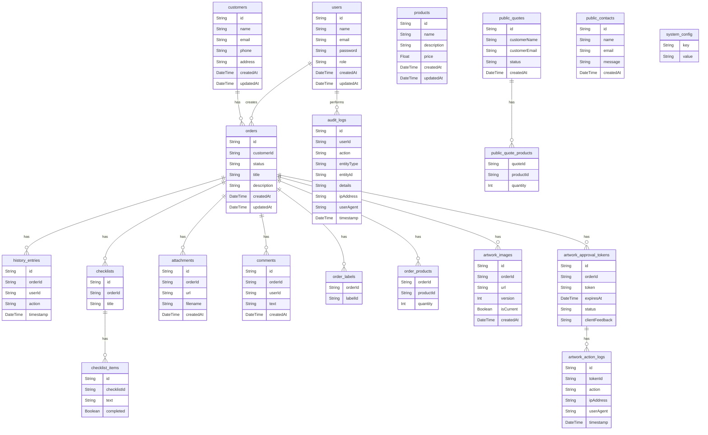

# Documentação do Banco de Dados - CRM ADDS

**Data:** 24 de Janeiro de 2026  
**Versão:** 1.0.0

---

## 1. Visão Geral

O banco de dados do CRM ADDS foi projetado para ser robusto, escalável e seguro, utilizando **PostgreSQL** como sistema de gerenciamento e **Prisma** como ORM para facilitar a interação com o banco de dados.

### Tecnologias Utilizadas

| Tecnologia | Descrição |
|------------|-----------|
| **PostgreSQL** | Banco de dados relacional open-source |
| **Prisma** | ORM (Object-Relational Mapping) para Node.js e TypeScript |

---

## 2. Diagrama de Entidade-Relacionamento (ER)

(Diagrama ER gerado a partir do schema Prisma)




---

## 3. Descrição das Tabelas

### Tabelas Principais

| Tabela | Descrição |
|--------|-----------|
| `users` | Armazena informações dos usuários do sistema, incluindo nome, email, senha (hash), papel (MASTER, GESTOR, PRESTADOR) e timestamps. |
| `customers` | Armazena informações dos clientes, incluindo nome, email, telefone, endereço e timestamps. |
| `orders` | Tabela central do sistema, armazena informações dos pedidos, incluindo cliente, status, título, descrição e timestamps. |
| `products` | Armazena informações dos produtos, incluindo nome, descrição, preço e timestamps. |
| `history_entries` | Registra o histórico de ações em um pedido, como mudança de status, para auditoria e rastreamento. |
| `checklists` | Armazena checklists associados a um pedido, para controle de tarefas. |
| `checklist_items` | Armazena os itens de um checklist, com status de completude. |
| `attachments` | Armazena informações sobre anexos de um pedido, como URL e nome do arquivo. |
| `comments` | Armazena comentários feitos em um pedido, com referência ao usuário que comentou. |
| `order_labels` | Tabela de junção para associar etiquetas (labels) a um pedido. |
| `order_products` | Tabela de junção para associar produtos a um pedido, com quantidade. |

### Tabelas de Arte e Aprovação

| Tabela | Descrição |
|--------|-----------|
| `artwork_images` | Armazena as imagens de arte enviadas para aprovação, com versionamento. |
| `artwork_approval_tokens` | Armazena os tokens de aprovação de arte, com status, expiração e feedback do cliente. |
| `artwork_action_logs` | Registra as ações realizadas em um token de aprovação de arte, como visualização e decisão. |

### Tabelas Públicas

| Tabela | Descrição |
|--------|-----------|
| `public_quotes` | Armazena orçamentos públicos criados por visitantes do site. |
| `public_contacts` | Armazena mensagens de contato enviadas por visitantes do site. |
| `public_quote_products` | Tabela de junção para associar produtos a um orçamento público. |

### Tabelas de Sistema

| Tabela | Descrição |
|--------|-----------|
| `audit_logs` | Registra todas as ações importantes realizadas no sistema, para auditoria e segurança. |
| `system_config` | Armazena configurações do sistema, como chaves de API e outras configurações dinâmicas. |

---

## 4. Migrations

As migrações do banco de dados são gerenciadas pelo Prisma. Para criar uma nova migração, use o comando:

```bash
npx prisma migrate dev --name <nome_da_migracao>
```

Para aplicar as migrações em um novo ambiente, use:

```bash
npx prisma migrate deploy
```

---

## 5. Seed

O arquivo `prisma/seed.ts` é usado para popular o banco de dados com dados iniciais, como usuários administradores, configurações padrão, etc. Para executar o seed, use:

```bash
npx prisma db seed
```

---

## 6. Conexão

As configurações de conexão com o banco de dados estão no arquivo `.env` do backend:

```env
DATABASE_URL="postgresql://<user>:<password>@<host>:<port>/<database>?schema=public"
```
